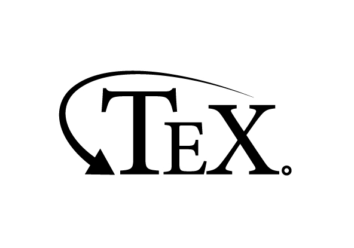

# TeansTex


**Let's Try! -> https://transtex.netlify.app**

PDFをコピペした時に含まれる謎の改行およびハイフネーションを取り除き，読みやすい（and 機械翻訳しやすい）段落分けして整形するアプリケーション．

整形後の文字列は，ワンクリックでそのままDeepLへ移動して翻訳でき，クリップボードへのコピーも可能．


# 開発者の方へ
本アプリケーションはGatsby.jsフレームワークを用いて作成されています．
開発にはNode.jsのランタイム環境が必要です．
（Node.js v16.xにて動作確認済）

```bash
# ライブラリをインストールする
$ yarn install
### or
$ npm install

# 開発用サーバを立ち上げる -> http://localhost:8000/
$ npm start
```

## Netlify Functions込みの動作確認
TransTexでは[TexTra](https://mt-auto-minhon-mlt.ucri.jgn-x.jp)と[Netlify Functions](https://www.netlify.com/products/functions/)利用した簡易翻訳機能を導入しています．
簡易翻訳機能の部分を開発する場合，開発サーバとしてNetlify Devを使用します．

```bash
# TexTra用の環境変数を用意します
# TexTraへログイン後，WebAPI一覧からAPI key等を取得し，
# .env.developmentの内容を書き換えてください
$ cp .env.sample .env.development

# Netlify Devにて，開発サーバを起動します
$ npm run netlify:dev
### or
$ yarn run netlify:dev

# なお，Netlify Functionsのみでも起動できます
$ npm run netlify:functions
### or
$ yarn run netlify:functions
```
